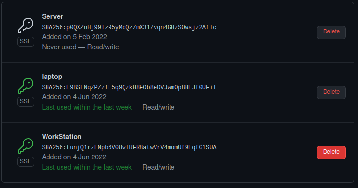
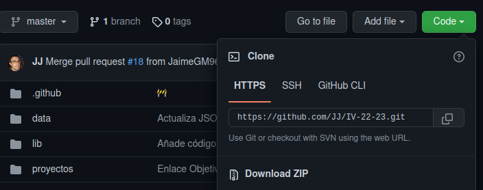
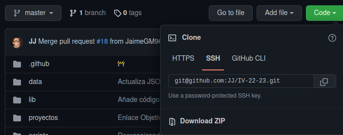

# Configuración de git

## Creación del par de claves

Lo primero que tenemos que hacer para usar nuestras claves, es crearlas.

Si nos remitimos a la propia [documentación de github](https://docs.github.com/en/authentication/connecting-to-github-with-ssh/generating-a-new-ssh-key-and-adding-it-to-the-ssh-agent), viene bastante bien explicado, no obstante, vamos a sintetizarlo un poco.

Lo primero es usar el comando `ssh-keygen -t ed25519 -C "your_email@example.com"`, sustituyendo *"your_email@example.com"* por nuestro correo de GitHub.

En mi caso quedaría `ssh-keygen -t ed25519 -C "jm.ramirez.gonza@gmail.com"`.

Esto nos pedirá que guardemos la clave ssh en algún lugar de nuestro dispositivo.

También nos pedirá una contraseña, que podemos no poner si no escribimos nada.

## Añadir las claves a nuestro agente ssh

Con la clave que creamos en el punto anterior, usamos el siguiente comando `ssh-add ~/.ssh/<nombreClave>`, siendo *\<nombreClave>* el nombre de la clave que creamos, esto le dirá a nuestro agente ssh que tiene que usar esa clave.

> Importante para este paso no usar la clave pública, es decir, hay que usar la clave generada que no acaba en *.pub*.

## Añadir claves a GitHub

Una vez tenemos las claves añadidas a nuestro agente de ssh, nos vamos al menú de opciones de nuestro perfil de GitHub, concretamente al submenú llamado *Claves SSH y GPG*.

Tenemos que copiar la clave pública que generamos en el primer paso (la que acaba en .pub), haciendo por ejemplo `cat ~/.ssh/<nombreClave>.pub` y copiando el resultado de ejecutar ese código.

Clickamos sobre el botón de añadir nueva clave ssh e introducimos un título para la misma. Pegamos la clave pública generada en el cuadrado donde se indica *key* o *clave*.

Es posible que se nos pida confirmación tras pulsar el botón de confirmar.
## Resultado final

Como se puede ver en la figura inferior, tenemos varias claves ssh que nos permiten hacer uso de nuestro repositorio desde nuestro portátil, nuestro ordenador de torre y nuestro servidor privado.

Esta foto es de mi perfil de GitHub, el menú de *Claves SSH y GPG*.

## Uso del par de claves

A partir de ahora, para usar nuestro par de claves, tan solo tendremos que asegurarnos de clonar un repositorio a local con el enlace de ssh, no con el de http.

Se puede apreciar en la figura inferior que una tiene la url de https y la otra de ssh.

Como vemos, la url de ssh comienza por *git@*, mientras que la url de https comienza por *https://*.

Si usamos la url de https, nos pedirá contraseña, la cual está sin soporte desde el 13 de agosto del 2021.

